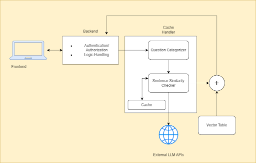
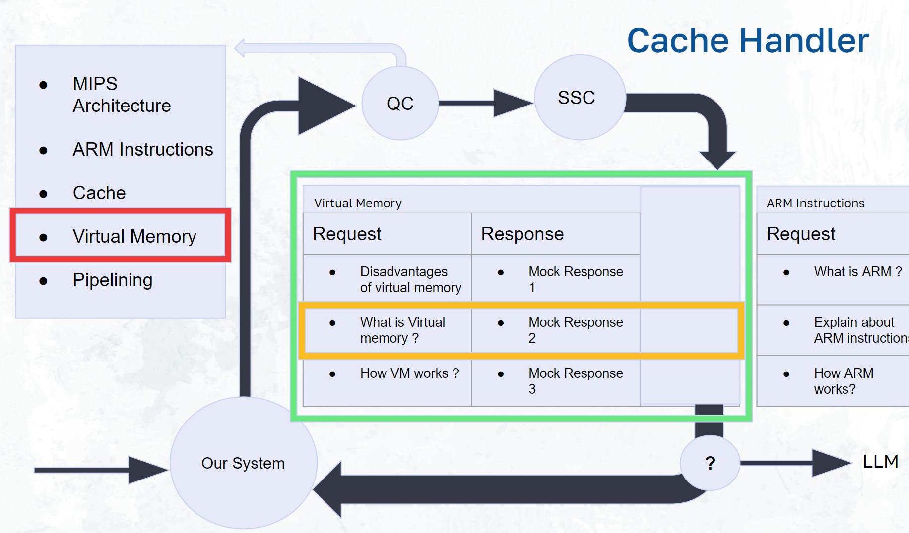

[comment]: # "This is the standard layout for the project, but you can clean this and use your own template"

# Large Language Models in Education

## Table of content

1. [Introduction](#introduction)
2. [Problem Statement](#problemstatement)
3. [Solution](#solution)

## Introduction
In the last few years, artificial intelligence has advanced significantly, particularly in the fields of generative AI and large language models (LLMs). These cutting-edge models have proven to be exceptionally capable of reading, writing, and producing content that is human-like, opening up new horizons in creativity and invention. The rise of generative AI has sparked a lot of curiosity about the possible uses it could have in a variety of industries. These generative AI models provide fascinating prospects in the field of education where technology integration is becoming more common. Intelligent tutoring systems have been sought after in education for a long time to improve and customize students’ learning experiences. The effectiveness of generative AI paired with the current trends in educational technology use offer a potent synergy that has the potential to completely change the educational environment. It offers great potential for involving students, encouraging creativity, and facilitating individualized learning journeys for them as generative AI models may produce tailored content, adaptive learning materials, and interactive simulations. The dawn of a new era in education is on the horizon, driven by the revolutionary potential of generative AI, as we observe the convergence of cutting-edge technology and educational methodology. We explore how LLM might be used in education as the basis for creating a smart tutor that is both affordable and successful. We aim to develop a cutting-edge teaching tool that can adapt to the demands of each individual student, deliver interactive and interesting learning experiences, and provide individualized assistance and support by harnessing the power of LLMs.

## Problem Statement

### Problems in LLMs in Education
- High Cost in LLMs
- Inability to access our own materials

LLMs can be expensive in terms of both time and computer resources, especially when done at scale. There are numerous ways to lower the cost and increase the effectiveness of the cost effective intelligent tutor. Then we are unable to get further readings of our own materials in the platforms. We should be able to get urls for further reading.

## Solution
As the solution a cost effective intelligent tutor is implemented as a web application. Our Target domain is Computer Architecture course materials.
Functionalities of the System
1. Question Categorizer
2. Sentence Similarity Checker

### High Level Architectural Diagram

### Cache Handler

#### Team

- E/17/297, Rupasinghe T. T. V. N., [e17297@eng.pdn.ac.lk](mailto:e17297@eng.pdn.ac.lk)
- E/17/206, Manohora H. T., [e17206@eng.pdn.ac.lk](mailto:e17206@eng.pdn.ac.lk)
- E/17/148, Kalpana M. W. V., [e17148@eng.pdn.ac.lk](mailto:e17148@eng.pdn.ac.lk)

#### Supervisors

- Dr. Damayanthi Herath, [damayanthiherath@eng.pdn.ac.lk](mailto:damayanthiherath@eng.pdn.ac.lk)
- Prof. Roshan G. Ragel, [roshanr@eng.pdn.ac.lk](mailto:roshanr@eng.pdn.ac.lk)
- Dr. Isuru Nawinne, [isurunawinne@eng.pdn.ac.lk](mailto:isurunawinne@eng.pdn.ac.lk)
- Dr. Shamane Siriwardhana, [gshasiri@gmail.com](mailto:gshasiri@gmail.com)

## Links

- [Project Repository](https://github.com/cepdnaclk/e17-4yp-Large-Language-Models-in-Education/){:target="_blank"}
- [Project Page](https://cepdnaclk.github.io/e17-4yp-Large-Language-Models-in-Education/){:target="_blank"}
- [Department of Computer Engineering](http://www.ce.pdn.ac.lk/)
- [University of Peradeniya](https://eng.pdn.ac.lk/)

[//]: # (Please refer this to learn more about Markdown syntax)
[//]: # (https://github.com/adam-p/markdown-here/wiki/Markdown-Cheatsheet)

